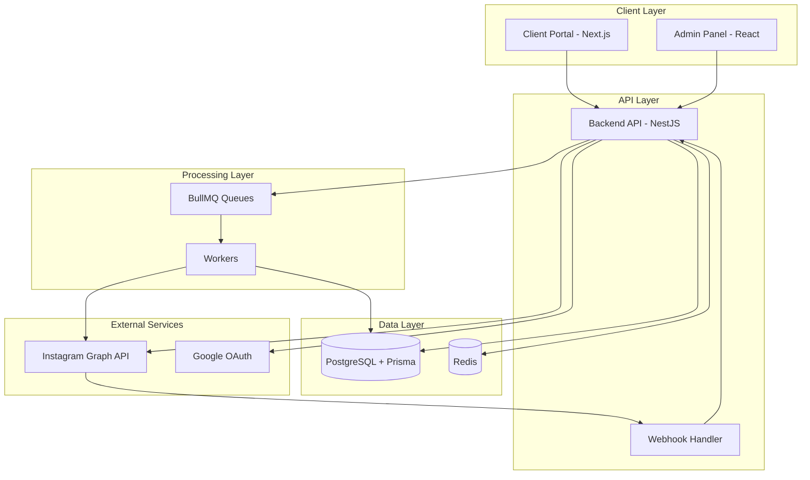
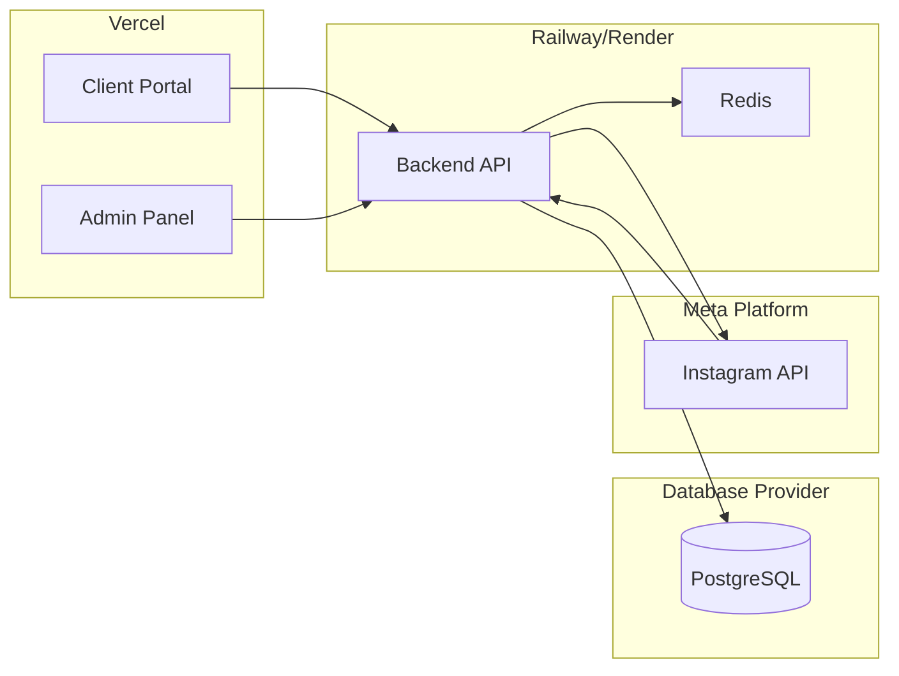
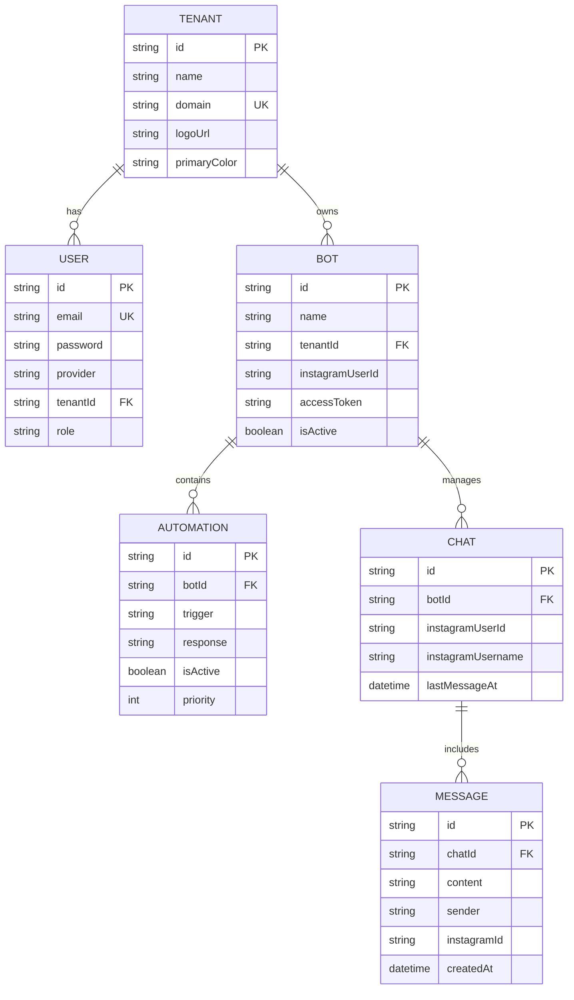
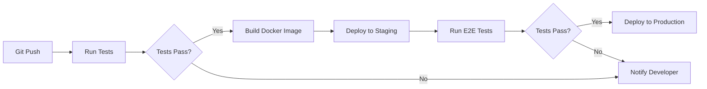

# Design Document

## Overview

The Instagram Chatbot SaaS platform is a white-label, multi-tenant system designed to enable automated Instagram Direct messaging at scale. The architecture follows a three-tier approach with a NestJS backend, React admin panel, and Next.js client portal. The system emphasizes data isolation, real-time communication, and seamless Instagram API integration.

### Key Design Principles

1. **Multi-tenancy First**: Every component is designed with tenant isolation as a core requirement
2. **Scalability**: Asynchronous processing and queue-based architecture support high message volumes
3. **Security**: JWT-based authentication, input validation, and encrypted credential storage
4. **Real-time**: WebSocket connections for live chat updates
5. **Modularity**: Clear separation of concerns with NestJS modules and React components

## Architecture

### System Architecture Diagram



### Deployment Architecture



### Multi-Tenancy Strategy

The platform implements **shared database with tenant identifier** pattern:

- Single database instance with `tenant_id` column in all tenant-specific tables
- Middleware intercepts all requests to extract and validate tenant context
- Prisma queries automatically include tenant filter
- Row-level security ensures data isolation
- Tenant context propagated through request lifecycle

## Components and Interfaces

### Backend API (NestJS)

#### Module Structure

```typescript
src/
├── main.ts                    // Application entry point
├── app.module.ts              // Root module
├── config/
│   ├── database.config.ts     // Prisma configuration
│   ├── auth.config.ts         // JWT and OAuth settings
│   └── instagram.config.ts    // Instagram API credentials
├── common/
│   ├── decorators/
│   │   ├── tenant.decorator.ts      // Extract tenant from request
│   │   └── current-user.decorator.ts // Extract user from JWT
│   ├── guards/
│   │   ├── jwt-auth.guard.ts        // JWT validation
│   │   └── tenant.guard.ts          // Tenant access control
│   ├── interceptors/
│   │   └── tenant.interceptor.ts    // Inject tenant context
│   └── filters/
│       └── http-exception.filter.ts // Global error handling
├── modules/
│   ├── auth/
│   │   ├── auth.module.ts
│   │   ├── auth.controller.ts
│   │   ├── auth.service.ts
│   │   ├── strategies/
│   │   │   ├── jwt.strategy.ts
│   │   │   └── google.strategy.ts
│   │   └── dto/
│   │       ├── login.dto.ts
│   │       └── register.dto.ts
│   ├── tenants/
│   │   ├── tenants.module.ts
│   │   ├── tenants.controller.ts
│   │   ├── tenants.service.ts
│   │   └── dto/
│   │       ├── create-tenant.dto.ts
│   │       └── update-tenant.dto.ts
│   ├── bots/
│   │   ├── bots.module.ts
│   │   ├── bots.controller.ts
│   │   ├── bots.service.ts
│   │   └── dto/
│   │       ├── create-bot.dto.ts
│   │       └── update-bot.dto.ts
│   ├── automations/
│   │   ├── automations.module.ts
│   │   ├── automations.controller.ts
│   │   ├── automations.service.ts
│   │   └── dto/
│   │       ├── create-automation.dto.ts
│   │       └── update-automation.dto.ts
│   ├── chats/
│   │   ├── chats.module.ts
│   │   ├── chats.controller.ts
│   │   ├── chats.service.ts
│   │   ├── chats.gateway.ts          // WebSocket gateway
│   │   └── dto/
│   │       └── send-message.dto.ts
│   ├── instagram/
│   │   ├── instagram.module.ts
│   │   ├── instagram.controller.ts   // Webhook endpoint
│   │   ├── instagram.service.ts      // API integration
│   │   └── dto/
│   │       └── webhook-payload.dto.ts
│   └── scheduler/
│       ├── scheduler.module.ts
│       ├── scheduler.service.ts
│       ├── processors/
│       │   ├── message.processor.ts
│       │   └── automation.processor.ts
│       └── dto/
│           └── schedule-message.dto.ts
└── prisma/
    └── schema.prisma
```

#### Key Interfaces

**Tenant Context Interface**
```typescript
interface TenantContext {
  tenantId: string;
  domain: string;
  logoUrl?: string;
  primaryColor?: string;
}
```

**Authentication Response**
```typescript
interface AuthResponse {
  accessToken: string;
  refreshToken: string;
  user: {
    id: string;
    email: string;
    tenantId: string;
  };
}
```

**Instagram Webhook Payload**
```typescript
interface InstagramWebhook {
  object: 'instagram';
  entry: Array<{
    id: string;
    time: number;
    messaging: Array<{
      sender: { id: string };
      recipient: { id: string };
      timestamp: number;
      message: {
        mid: string;
        text: string;
      };
    }>;
  }>;
}
```

### Admin Panel (React)

#### Component Structure

```
src/
├── main.tsx
├── App.tsx
├── pages/
│   ├── Login.tsx
│   ├── Dashboard.tsx
│   ├── Tenants/
│   │   ├── TenantList.tsx
│   │   ├── TenantForm.tsx
│   │   └── TenantDetail.tsx
│   ├── Bots/
│   │   ├── BotList.tsx
│   │   ├── BotForm.tsx
│   │   └── BotDetail.tsx
│   ├── Automations/
│   │   ├── AutomationList.tsx
│   │   ├── AutomationForm.tsx
│   │   └── FlowBuilder.tsx
│   └── Metrics/
│       └── MetricsDashboard.tsx
├── components/
│   ├── Layout/
│   │   ├── Sidebar.tsx
│   │   ├── Header.tsx
│   │   └── MainLayout.tsx
│   ├── Forms/
│   │   ├── Input.tsx
│   │   ├── Select.tsx
│   │   └── FileUpload.tsx
│   └── Charts/
│       ├── LineChart.tsx
│       └── BarChart.tsx
├── services/
│   ├── api.ts              // Axios instance
│   ├── auth.service.ts
│   ├── tenant.service.ts
│   ├── bot.service.ts
│   └── automation.service.ts
├── hooks/
│   ├── useAuth.ts
│   ├── useTenants.ts
│   └── useBots.ts
├── contexts/
│   └── AuthContext.tsx
└── utils/
    ├── validators.ts
    └── formatters.ts
```

### Client Portal (Next.js)

#### Page Structure

```
src/
├── middleware.ts              // Tenant detection
├── pages/
│   ├── _app.tsx
│   ├── _document.tsx
│   ├── index.tsx             // Landing/Login
│   ├── dashboard.tsx
│   ├── chats/
│   │   ├── index.tsx         // Chat list
│   │   └── [id].tsx          // Chat detail
│   ├── clients/
│   │   └── index.tsx
│   ├── schedules/
│   │   └── index.tsx
│   └── settings/
│       └── index.tsx
├── components/
│   ├── Layout/
│   │   ├── DashboardLayout.tsx
│   │   └── Header.tsx
│   ├── Chat/
│   │   ├── ChatList.tsx
│   │   ├── ChatWindow.tsx
│   │   └── MessageBubble.tsx
│   ├── Schedule/
│   │   ├── ScheduleForm.tsx
│   │   └── ScheduleList.tsx
│   └── Branding/
│       └── ThemeProvider.tsx
├── lib/
│   ├── api.ts
│   ├── websocket.ts
│   └── tenantContext.ts
├── hooks/
│   ├── useTenant.ts
│   ├── useChats.ts
│   └── useWebSocket.ts
└── styles/
    └── globals.css
```

#### Tenant Detection Middleware

```typescript
// middleware.ts
export function middleware(request: NextRequest) {
  const hostname = request.headers.get('host');
  const subdomain = hostname?.split('.')[0];
  
  // Extract tenant from subdomain
  if (subdomain && subdomain !== 'www') {
    request.headers.set('x-tenant-domain', subdomain);
  }
  
  return NextResponse.next();
}
```

## Data Models

### Prisma Schema

```prisma
generator client {
  provider = "prisma-client-js"
}

datasource db {
  provider = "postgresql"
  url      = env("DATABASE_URL")
}

model Tenant {
  id           String   @id @default(cuid())
  name         String
  domain       String   @unique
  logoUrl      String?
  primaryColor String?  @default("#3182CE")
  createdAt    DateTime @default(now())
  updatedAt    DateTime @updatedAt
  
  users        User[]
  bots         Bot[]
  
  @@index([domain])
}

model User {
  id        String   @id @default(cuid())
  email     String   @unique
  password  String?
  provider  String?  // "local" | "google"
  providerId String?
  tenantId  String
  role      String   @default("user") // "admin" | "user"
  createdAt DateTime @default(now())
  updatedAt DateTime @updatedAt
  
  tenant    Tenant   @relation(fields: [tenantId], references: [id], onDelete: Cascade)
  
  @@index([tenantId])
  @@index([email])
}

model Bot {
  id              String   @id @default(cuid())
  name            String
  tenantId        String
  instagramUserId String?
  accessToken     String?  // Encrypted
  isActive        Boolean  @default(true)
  createdAt       DateTime @default(now())
  updatedAt       DateTime @updatedAt
  
  tenant          Tenant      @relation(fields: [tenantId], references: [id], onDelete: Cascade)
  automations     Automation[]
  chats           Chat[]
  
  @@index([tenantId])
}

model Automation {
  id        String   @id @default(cuid())
  botId     String
  trigger   String   // Keyword or pattern
  response  String   // Response message
  isActive  Boolean  @default(true)
  priority  Int      @default(0)
  createdAt DateTime @default(now())
  updatedAt DateTime @updatedAt
  
  bot       Bot      @relation(fields: [botId], references: [id], onDelete: Cascade)
  
  @@index([botId])
}

model Chat {
  id                String   @id @default(cuid())
  botId             String
  instagramUserId   String
  instagramUsername String?
  lastMessageAt     DateTime @default(now())
  createdAt         DateTime @default(now())
  
  bot               Bot      @relation(fields: [botId], references: [id], onDelete: Cascade)
  messages          Message[]
  
  @@unique([botId, instagramUserId])
  @@index([botId])
  @@index([lastMessageAt])
}

model Message {
  id          String   @id @default(cuid())
  chatId      String
  content     String
  sender      String   // "bot" | "user"
  instagramId String?  // Instagram message ID
  createdAt   DateTime @default(now())
  
  chat        Chat     @relation(fields: [chatId], references: [id], onDelete: Cascade)
  
  @@index([chatId])
  @@index([createdAt])
}

model ScheduledMessage {
  id          String   @id @default(cuid())
  botId       String
  recipient   String   // Instagram user ID
  content     String
  scheduledAt DateTime
  status      String   @default("pending") // "pending" | "sent" | "failed"
  sentAt      DateTime?
  error       String?
  createdAt   DateTime @default(now())
  
  @@index([scheduledAt, status])
}
```

### Entity Relationships



## Error Handling

### Error Response Format

All API errors follow a consistent format:

```typescript
interface ErrorResponse {
  statusCode: number;
  message: string | string[];
  error: string;
  timestamp: string;
  path: string;
}
```

### Error Categories

1. **Authentication Errors (401)**
   - Invalid credentials
   - Expired token
   - Missing token

2. **Authorization Errors (403)**
   - Insufficient permissions
   - Cross-tenant access attempt

3. **Validation Errors (400)**
   - Invalid input data
   - Missing required fields
   - Format violations

4. **Not Found Errors (404)**
   - Resource doesn't exist
   - Invalid tenant domain

5. **External Service Errors (502/503)**
   - Instagram API failures
   - Database connection issues
   - Redis unavailable

### Error Handling Strategy

**Backend**
- Global exception filter catches all errors
- Logs errors with context (tenant, user, request)
- Sanitizes error messages before sending to client
- Integrates with Sentry for critical errors

**Frontend**
- Toast notifications for user-facing errors
- Retry logic for transient failures
- Fallback UI for critical component failures
- Error boundaries in React components

## Testing Strategy

### Backend Testing

**Unit Tests**
- Service layer business logic
- Utility functions and helpers
- Validation logic
- Target: 80% code coverage

**Integration Tests**
- API endpoint testing
- Database operations
- Authentication flows
- Webhook processing

**E2E Tests**
- Complete user workflows
- Multi-tenant scenarios
- Instagram integration flows

### Frontend Testing

**Component Tests**
- React component rendering
- User interactions
- Form validation
- State management

**Integration Tests**
- API integration
- WebSocket connections
- Routing and navigation

### Testing Tools

- **Backend**: Jest, Supertest, Prisma test environment
- **Frontend**: Vitest, React Testing Library, Playwright
- **API Testing**: Postman/Insomnia collections
- **Load Testing**: k6 or Artillery for performance testing

### CI/CD Pipeline



### Performance Requirements

- API response time: < 200ms (p95)
- Webhook processing: < 5 seconds
- WebSocket message delivery: < 2 seconds
- Database query time: < 100ms (p95)
- Concurrent users per tenant: 100+
- Messages per second: 50+ per bot

### Security Measures

1. **Authentication**
   - JWT with short expiration
   - Refresh token rotation
   - OAuth 2.0 for Google

2. **Data Protection**
   - Encrypted Instagram credentials
   - HTTPS only
   - Environment variable secrets

3. **Input Validation**
   - DTO validation with class-validator
   - SQL injection prevention via Prisma
   - XSS protection

4. **Rate Limiting**
   - 100 requests/minute per IP
   - Separate limits for webhook endpoints
   - Tenant-based quotas

5. **Monitoring**
   - Sentry for error tracking
   - Request logging
   - Audit trail for sensitive operations
